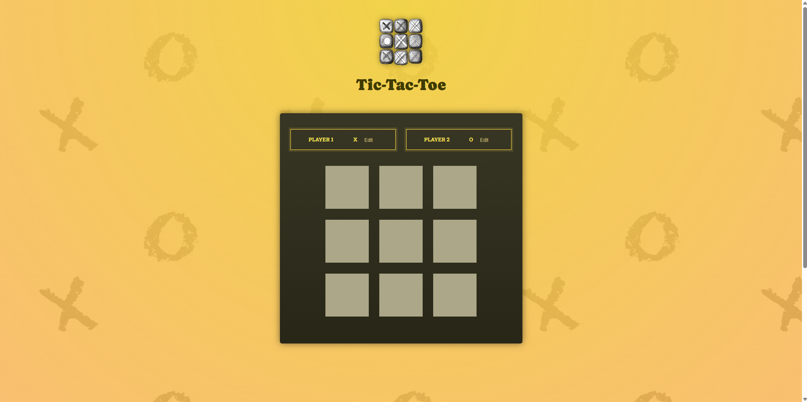

# Tic-Tac-Toe Game



A simple Tic-Tac-Toe game built with React. This project demonstrates the basics of React components, state management, and event handling.

## Features

- Playable Tic-Tac-Toe game
- Tracks the current player
- Highlights the winning combination

## Installation

1. Clone the repository:
   ```bash
   git clone https://github.com/DVANH0302/react-tic-tac-toe.git
   ```
2. Navigate to the project directory:
   ```bash
   cd react-tic-tac-toe
   ```
3. Install dependencies:
   ```bash
   npm install
   ```
4. Start the development server:
   ```bash
   npm run dev
   ```

## Technologies Used

- React
- JavaScript
- CSS

## License

This project is licensed under the MIT License. See the [LICENSE](LICENSE) file for details.
